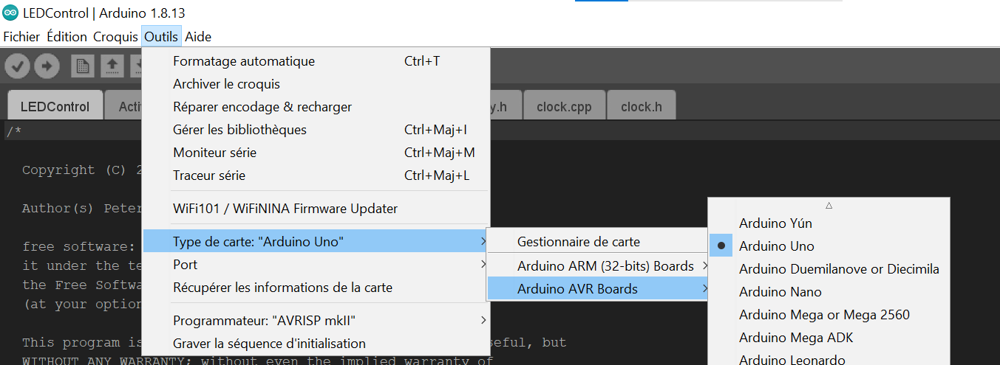
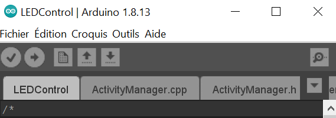
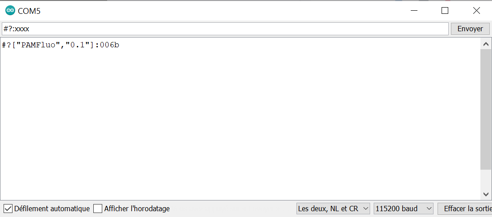
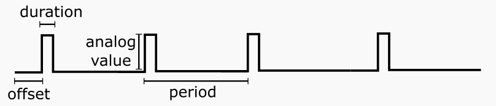

# CSL-light

This repository demonstrates how to control light sources with Arduino and Python, and output a trigger signal to synchronize a camera. 

The codes rely on [Arduino](https://www.arduino.cc/) and [pyserial](https://github.com/pyserial/pyserial).


## Pre-requisites
- Install RomiSerial and the Arduino software XXXX
- The light sources are already set-up. Refer to the example gallery for ideas. 
- The light sources can be controlled by a trigger, or pulse-width modulated signal (PWM) 
- The code was tested on Windows and Linux
  


## Hardware :gear:
Here are the different hardware equipment the 

| Component | Quantity | Price per unit | Example |
|----------|:-------------:|:-------------:|:-------------:|  
| Arduino Uno | 1| 24€ | [Robotshop](https://www.robotshop.com/eu/fr/microcontroleur-arduino-uno-r3-usb.html)
|  Light source controller | tested up to 5 | X| [Thorlabs](https://www.thorlabs.com/newgrouppage9.cfm?objectgroup_id=2616) 

## Software :desktop_computer:


| Software | Version we used | Download |
|----------|:-------------:|:-------------:|  
| Arduino | 1.8.13 | [download](https://www.arduino.cc/en/software)
| Python  | 3 |[install](https://github.com/Alienor134/Teaching/blob/master/Python/Installing_Anaconda_creating_environment.md)
| CSL-serial | 1.0 | [install](XXX)

## Codes and files provided :chart_with_upwards_trend:


An [Arduino code](LEDControl/LEDControl.ino) is provided to control the motors. An extra layer is added in Python to control it easily.

[CSLlight](CSLlight/CSLlight.py) can be used the following way:


```python
from serial import Serial
from CSLlight import add_digital_pulse, start_measurement, stop_measurement

arduino_port = "COM5"
sec = 1000 #conversion ms to s
blue_param = {'pin': 11,
            'offset': 0.5*sec, #ms
            'period': 5*sec, #ms
            'duration': 2*sec, #ms
            'secondary': 1,
            'analog_value': 255,
            }

link = Serial(arduino_port)
add_digital_pulse(link, blue_param)

start_measurement(link)
time.sleep(300)
stop_measurement(link)

```


# Instructions:
Download or clone the repository:
```
git clone XXXXXXXX
```

## Control the LEDs 


1. Get the wiring to connect the Arduino to the light source controller. To begin, connect the wire to **pin 11**. 

2. Open the [.ino](/ArduinoControl/LEDControl/LEDControl.ino) file.
3. Select the Arduino board type in the "Tools/card type"
<p align="center">
<a> </a>
</p>
1. Select the COM port. If the name of the board doesn't appear near any port, change the port USB until the name appears.

<p align="center">
<a> </a>
</p>

5. Press the check sign. If an error related to "RomiSerial" appears, verify that you have properly followed the instructions in the CSL-Serial repository. 
<p align="center">
<a> </a>
</p>

6. If no error appears you can click the arrow to load the code in the Arduino. 
 
7. To test that you can properly interact with the Arduino, click on the magnifying glass in the upper right to open the serial monitor and type: "#?:xxxx" and ensure you get this output: 
 <p align="center">
<a> </a>
</p>


8. type: **#?:[11,0,0,2,0,1,0,0,255]**
   You should see the LEDs blink (frequency 0.5Hz) 

## Install the library

```
cd CSL-light
python setup.py develop
```
1. Try running the code: 

On Windows: ```python  CSLlight/CSLlight.py --port COMx``` by replacing "COMx" by the correct COM port identified in step 1. 


On Linux: ```python3  CSLlight/CSLlight.py --port /dev/ttyACM0```

You should see the LED blink. 

2. Open the python code to see how it works. Open the python code [CSLlight.py](CSLlight/CSLlight.py). The code is commented and allows to control the frequency and amplitude of the LEDs. Set the parameters: 
The content of interest is after ``if __name__ == __main__:`` 
- replace the COM port with the one of your set-up ([tutorial](https://www.arduino.cc/en/Guide/ArduinoUno)). 
- input the correct ports for the LED control. The port 3 and 11 are good choices because they are PWM pins which allow to control the intensity level of the LEDs rather than only ON-OFF. 
- you can change the other parameters that correspond to this scheme: 

 <p align="center">
<a> </a>
</p>


## Examples of implementation
[How to make a gallery](https://felixhayashi.github.io/ReadmeGalleryCreatorForGitHub/)
</img> </img> </img> 


(Note: to build an LED controller refer to this [OpenUC2 repository](https://github.com/SonyCSLParis/UC2_Fluorescence_microscope), otherwise you might already use one of these [Thorlabs controlers](https://www.thorlabs.com/navigation.cfm?guide_id=2109)

## License

This project is licensed under the [GNU General Public License v3.0](https://www.tldrlegal.com/license/gnu-general-public-license-v3-gpl-3)